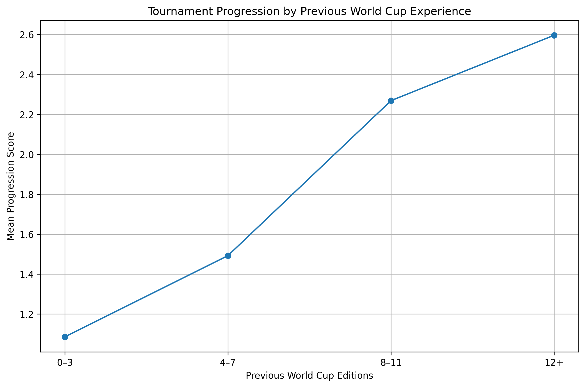

# Hypothesis 3 — Previous World Cup Experience vs Tournament Performance

## Hypothesis

> Teams with greater previous FIFA World Cup experience tend to perform better in subsequent World Cup tournaments.

---

## Objective

Determine whether a team's previous FIFA World Cup experience is associated with its progression in a subsequent tournament.

Previous World Cup experience is measured using two variables:

- `Previous_WC_Editions` — number of World Cup editions the team participated in before the current tournament.
- `Previous_WC_Matches` — number of World Cup matches the team played before the current tournament.

Tournament performance is represented by `Progression_Score`.

---

## Dataset

The analysis uses the processed historical World Cup dataset:

`data/processed/historical_world_cup_processed.csv`

The dataset contains one observation for each team participating in each World Cup from 1930 to 2022.

### Key variables

| Variable               | Description                                               |
| ---------------------- | --------------------------------------------------------- |
| `Year`                 | World Cup edition                                         |
| `Team`                 | Team name as recorded for that tournament                 |
| `Historical_Team`      | Standardized team identity across historical name changes |
| `Previous_WC_Editions` | Previous World Cup appearances before the current edition |
| `Previous_WC_Matches`  | Previous World Cup matches before the current edition     |
| `Progression_Score`    | Normalized tournament progression score                   |
| `Final_Stage`          | Final stage reached by the team                           |

---

## Data Validation

Before analysis, the experience variables were validated.

The following checks were performed:

1. Teams making their first World Cup appearance must have zero previous World Cup matches.
2. Previous World Cup edition counts must not decrease over time for a historical team.
3. Previous World Cup match counts must not decrease over time for a historical team.
4. Required H3 variables must contain no missing values.

All validation checks passed.

---

## Methodology

### 1. Spearman Rank Correlation

Spearman's rank correlation was used because `Progression_Score` is an ordinal/discrete measure rather than a continuous normally distributed variable.

Two relationships were tested:

- Previous World Cup editions vs progression score
- Previous World Cup matches vs progression score

The significance level was set at:

`α = 0.05`

---

### 2. Experience Bands

To provide a more stable descriptive comparison and avoid over-interpreting experience levels represented by very few teams, teams were grouped into four experience bands:

| Experience | Previous WC Editions |
| ---------- | -------------------- |
| Low        | 0–3                  |
| Moderate   | 4–7                  |
| High       | 8–11                 |
| Very High  | 12+                  |

Mean and median progression scores were calculated for each group.

---

### 3. Kruskal–Wallis Test

A Kruskal–Wallis H test was used to determine whether progression-score distributions differed significantly between the four experience groups.

This test was selected because the progression score is discrete and ordinal in nature.

---

## Results

### Spearman Correlation

#### Previous World Cup Editions

- Spearman ρ = **0.294**
- p < **0.001**
- ρ² = **0.087**

There is a statistically significant positive association between previous World Cup appearances and subsequent tournament progression.

#### Previous World Cup Matches

- Spearman ρ = **0.304**
- p < **0.001**
- ρ² = **0.092**

Previous World Cup matches show a similarly significant positive association with subsequent tournament progression.

---

## Experience Band Analysis

| Previous WC Editions | Teams | Mean Progression | Median Progression |
| -------------------: | ----: | ---------------: | -----------------: |
|                  0–3 |   235 |            1.085 |               0.00 |
|                  4–7 |   134 |            1.492 |               1.33 |
|                 8–11 |    68 |            2.269 |               1.33 |
|                  12+ |    52 |            2.596 |               2.67 |

Mean progression increases consistently across all four experience bands:

**1.085 → 1.492 → 2.269 → 2.596**

This provides a clear descriptive pattern in which teams with greater previous World Cup experience tend to progress further.

---

## Kruskal–Wallis Test

- H = **48.752**
- p < **0.001**

The result indicates that progression-score distributions differ significantly across the four World Cup experience groups.

---

## Visualization

The relationship between previous World Cup experience and tournament progression is visualized using the mean progression score for each experience band.

The visualization shows a clear upward trend in mean progression as previous World Cup experience increases.

---

## Conclusion

**H3 is supported.**

The analysis finds a statistically significant positive association between previous World Cup experience and tournament progression.

Both measures of experience show similar results:

- Previous World Cup editions: **ρ = 0.294, p < 0.001**
- Previous World Cup matches: **ρ = 0.304, p < 0.001**

The experience-band analysis further shows that mean progression increases from **1.085** among teams with 0–3 previous appearances to **2.596** among teams with 12+ previous appearances.

The Kruskal–Wallis test also confirms statistically significant differences in progression distributions between the experience groups (**H = 48.752, p < 0.001**).

### Important interpretation

The results demonstrate **association, not causation**. The analysis does not establish that previous World Cup experience itself causes better performance. Other factors such as team quality, player generation, squad strength, and other tournament-specific factors may also influence progression.

---

## Reproducibility

The analysis is implemented in:

`src/hypothesis_3.py`

The historical World Cup preprocessing pipeline is implemented in:

`src/preprocessing/historical_world_cup.py`

The processed dataset used by H3 is:

`data/processed/historical_world_cup_processed.csv`

The generated visualization is:

`visuals/hypothesis_3/experience_vs_progression.png`
